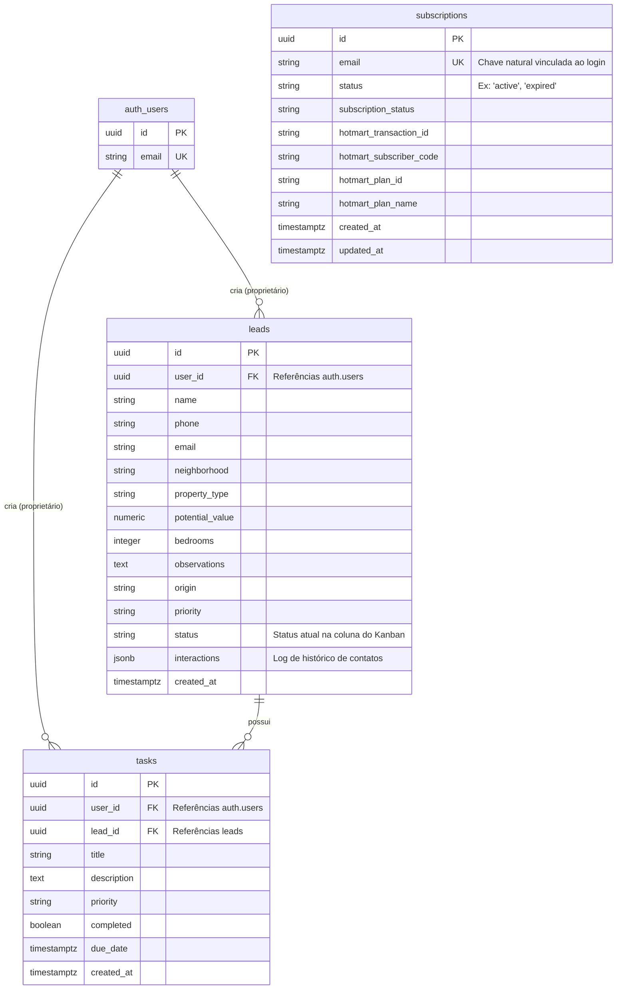
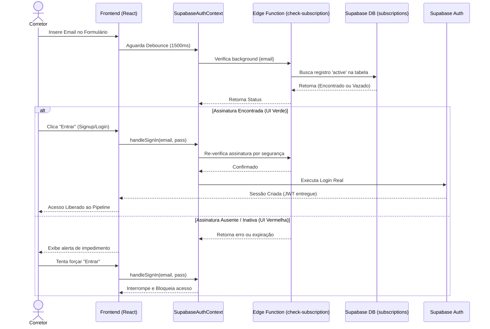
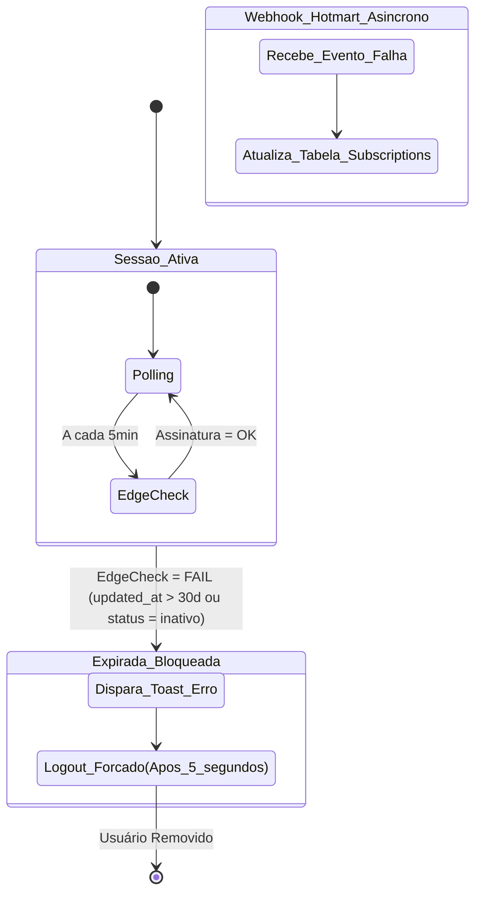

# Auditoria Técnica e Documentação do Sistema - Pipeline Alfa

Este documento contém o mapeamento e análise estrutural de todo o sistema **Pipeline Alfa** atual (março de 2026). Trata-se de uma visão técnica aprofundada voltada para desenvolvedores e arquitetos de software.

---

## A. VISÃO GERAL DO SISTEMA

**Objetivo do Sistema:**
Um CRM/Pipeline de Vendas (estilo Kanban) para corretores imobiliários, incorporando um sistema robusto de controle de acesso atrelado a assinaturas da plataforma Hotmart.

**Stack Tecnológica:**
*   **Frontend / UI:** React 18, Vite, TailwindCSS, Radix UI (shadcn/ui componentes subjacentes), Framer Motion para animações.
*   **Backend / BaaS:** Supabase (PostgreSQL para Banco de Dados, Supabase Auth para Autenticação, Supabase Edge Functions / Deno para regras server-side).
*   **Linguagens Principais:** JavaScript (React frontend) e TypeScript (Supabase Edge Functions).

**Arquitetura:**
Trata-se de uma arquitetura baseada em **BaaS (Backend as a Service)**, ou seja, uma aplicação SPA (Single Page Application) estática no frontend que se comunica diretamente com a nuvem do Supabase via APIs geradas automaticamente, somado ao uso de **Serverless Edge Functions** para validações e integrações externas focadas em segurança. Não existe um servidor Node/Express tradicional centralizado.

**Diagrama Lógico da Arquitetura:**

```mermaid
flowchart TD
    Client[Cliente / Navegador (React UI)]
    
    subgraph Frontend [SPA - Vite + React]
        App[App.jsx]
        Auth[SupabaseAuthContext]
        Dashboard[Kanban & CRM]
        HotmartClient[hotmartService.js ⚠️ Falha]
    end

    subgraph Supabase [Backend as a Service]
        DB[(PostgreSQL DB)]
        SAuth[Supabase Auth JWT]
        Edge[Edge Functions]
        Webhook[hotmart-webhook ❓]
    end

    subgraph External [Serviços Externos]
        Hotmart[Hotmart APIs]
    end

    Client --> Frontend
    App --> Auth
    App --> Dashboard
    
    Auth -- "Autentica usuário" --> SAuth
    Dashboard -- "CRUD CRM" --> DB
    Auth -- "Valida Inscrição" --> Edge
    
    HotmartClient -. "Consulta Direta (Inseguro)" .-> Hotmart
    Hotmart -- "POST (Status Compra)" --> Webhook
    Webhook -- "Upsert Subscriptions" --> DB
```

---

## B. ESTRUTURA DE PASTAS

A estrutura raiz reflete um projeto padrão Vite + Supabase:

*   **`/.agent/`**: Ferramentas, skills e documentação/metadados da automação por IA do projeto (Antigravity Kit).
*   **`/public/`**: Assets estáticos servidos no build.
*   **`/src/`**: Coração do aplicativo frontend em React.
    *   `components/`: Todos os componentes React (Modais, Layout, Kanban, Botões). A subpasta `ui/` acomoda pequenos fragmentos de interface reusáveis estilizados via Tailwind.
    *   `contexts/`: Gerenciamento de estado global. Possui o `SupabaseAuthContext.jsx` que envolve o app controlando logins e a assinatura na Hotmart.
    *   `lib/`: Utilitários, constantes e serviços. Destacam-se os adapters `subscriptionService.js` e `hotmartService.js`.
*   **`/supabase/`**: Diretório obrigatório do Supabase Local/CLI.
    *   `functions/`: Código das Edge Functions (Serverless). Contém apenas `check-subscription`.
*   **`/tools/` & `/plugins/`**: Scripts secundários de infra e automação/build.
*   *Na Raiz:* Configurações cruciais como `vite.config.js`, `tailwind.config.js`, `package.json` e os manuais de overview de assinaturas (ex: `SUBSCRIPTION_SYSTEM.md`).

---

## C. BACKEND (Supabase Edge Functions)

Não existe um servidor monolítico. A lógica de negócio no lado do servidor é implementada nas Edge Functions hospedadas no Supabase.

### 1. Endpoint: `/check-subscription`
*   **Localização:** `supabase/functions/check-subscription/index.ts`
*   **Métodos Permitidos:** POST, GET (+ OPTIONS para CORS).
*   **Entrada (Parâmetros):** `{ "email": "string" }` (No corpo para POST, ou URL Query string para GET).
*   **Fluxo de Execução:** Usa a *Service Role Key* (bypassa RLS do DB) para consultar a tabela `subscriptions`.
*   **Regra de Negócio (Validação):** Busca uma assinatura "active" vinculada ao email. Retorna como expirada se o campo `updated_at` do registro for anterior a 30 dias contados a partir do momento atual.
*   **Retorno:** Objeto JSON com as flags `success`, `hasActiveSubscription`, e objeto `subscription`.

### Inconsistência Importante (Falta de Webhook)
A documentação do projeto (`SUBSCRIPTION_SYSTEM.md`) cita uma rota de backend: `supabase/functions/hotmart-webhook/index.ts`. **Este arquivo NÃO EXISTE na estrutura do projeto na máquina.**
Provavelmente a função foi deployada diretamente via Dashboard da nuvem no Supabase ou foi deletada acidentalmente do repositório local.

---

## D. BANCO DE DADOS

O banco PostgreSQL hospeda-se no Supabase. As seguintes tabelas e regras foram inferidas pelo código dos clientes (uma vez que *não há arquivos `.sql` ou diretório `/migrations` presentes no projeto*).

### Diagrama Entidade-Relacionamento (ER)



### Estrutura Detalhada das Tabelas Avaliadas:

#### 1. Tabela `subscriptions`
Tabela passiva preenchida primariamente pela integração via Webhook da Hotmart (recebendo os eventos de transação e estorno). O Supabase Auth não cria as assinaturas automaticamente, ele apenas as lê.
- **Chaves:** `id` (UUID - PK), `email` (TEXT - UNIQUE). O vínculo com a identidade do usuário no frontend ocorre checando a paridade de seu e-mail de login com esta tabela.
- **Controle de Estado:** `status`, `subscription_status` (ativos para decidir a barreira de acesso à ferramenta).
- **Metadados Financeiros:** `hotmart_transaction_id`, `hotmart_subscriber_code`, `hotmart_plan_id`, `hotmart_plan_name`.
- **Timestamps:** `created_at`, `updated_at` (Vital para controle de expiração baseada em tempo).

#### 2. Tabela `leads`
Coração do CRM (Customer Relationship Management) e do Pipeline de vendas, armazena os clientes ou prospects imobiliários.
- **Segurança (RLS):** Coluna obrigatória `user_id` aponta internamente pra tabela isolada `auth.users(id)` do gerenciamento JWT, garantindo o "Tenant Isolation" onde um corretor não enxerga leads de outro corretor.
- **Campos do Cliente:** `name`, `phone`, `email`.
- **Requisitos de Cadastro Imobiliário:** `neighborhood`, `property_type`, `potential_value`, `bedrooms`, `observations`.
- **Qualificação:** `origin`, `priority`, e `status` (Status dita as raias do drag and drop).
- **Histórico (Extra):** O campo `interactions` é do tipo NoSQL (`jsonb`). Trata-se de um array embutido preservando a linha do tempo de anotações e mensagens trocadas sem demandar JOINs.

#### 3. Tabela `tasks`
Gerenciador de tarefas/To-Dos ligadas à conta do corretor.
- **Relacionamentos:** `user_id` (proprietário), e `lead_id` (ligação opcional com os cartões do pipeline).
- **Controle:** `title`, `description`, `priority`, `completed` (boolean de checkbox).
- **Cronologia:** `due_date`, `created_at`.

> **⚠️ Débito Técnico Crítico:** Nenhum Schema declarativo (DDL) está no Git. Isso quebra a capacidade de recriar ambientes limpos rapidamente. As tabelas parecem ter sido criadas manualmente usando a interface do Supabase.

---

## E. FRONTEND

Aplicação construída em painel unificado:

*   **Roteamento e Orquestração (`App.jsx`):** Em vez de usar React Router com várias URLs, o componente App faz a amarração declarativa: renderiza a tela de Auth se não há sessão, tela de Reset se reconhece tokens na URL, ou a área contendo O Kanban (`Dashboard` + `KanbanBoard`) quando autenticado e com assinatura ativa.
*   **Contexto (`SupabaseAuthContext.jsx`):** O guardião do sistema. Nele repousam as chamadas de `signIn`, `signUp` e `resetPassword`. Todos interceptam o cadastro para **verificar de forma assíncrona se a assinatura existe e é válida** antes de criar o usuário no Supabase Auth.
*   **Serviços Locais (`lib/`):**
    *   `subscriptionService.js`: Chama a Edge Function `/check-subscription` como via principal. Em caso de falha de rede/Edge, possui um *fallback* programado via cliente direto ao DB Supabase (uma manobra válida, mas caso o Row Level Security estiver restrito para não-autenticados, esse fallback no Login falhará).
*   **Responsividade:** Interfaces feitas com classes utilitárias do TailwindCSS para se adaptarem de mobile a desktops largos.

---

## F. INTEGRAÇÕES EXTERNAS E CHAVES

1.  **Supabase:** Funciona via `@supabase/supabase-js`. Consome `VITE_SUPABASE_URL` e `VITE_SUPABASE_ANON_KEY`.
2.  **Hotmart:**
    *   **Envio de Eventos (Push):** Webhooks disparam de "dentro da Hotmart" para a Edge Function de nome "*hotmart-webhook*" (que está ativa na nuvem mas sumiu do repositório). Ela valida o Segredo de Webhook (`HOTMART_WEBHOOK_SECRET`) para confirmar a autenticidade antes de salvar a inscrição no Banco.
    *   **Consulta Ativa (Pull) - `hotmartService.js`:** Um serviço codificado no frontend que permite consultar à força os servidores da Hotmart para ver se a assinatura existe, gerando tokens OAuth dinâmicos.

---

## G. FLUXOS PRINCIPAIS

### Fluxograma de Autenticação e Verificação de Pagamento



### 1. Fluxo Principal do Pipeline (Kanban)
1.  Usuário logado aciona carregamento de `leads` e `tasks`.
2.  A UI do Kanban (`@hello-pangea/dnd`) monta as colunas (Novo, Em Contato, visita-marcada, etc).
3.  Na arrastagem (Drag-and-Drop), o componente levanta onDragEnd e atualiza *imediatamente* via API (REST over PostgREST do Supabase) mudando o campo `status` daquele lead no banco.

### 2. Fluxograma de Expiração Forçada (Background Muting)



---

## H. SEGURANÇA

A segurança perimetral do acesso à aplicação (impedir desconhecidos) é excelente logicamente, pois é blindada a múltiplos testes: no formulário ao digitar, no botão de registrar, e a cada 5 minutos logados em polling.

*Mecanismos Empregados:* Tokens JWT via Supabase, Fetch Auth nativos. RLS ativo banco de dados (presumido) isolando tenants pela coluna `user_id`.

No entanto, o projeto sofre de falhas graves na implementação de client-side secrets descritos logo abaixo.

---

## I. PONTOS CRÍTICOS E GRAVES (URGENTE)

**1. VAZAMENTO DE SEGREDOS NO FRONTEND (VULNERABILIDADE CRÍTICA MÁXIMA) 🔴🔴🔴🔴**
O arquivo `src/lib/hotmartService.js` foi configurado para autenticar na API da plataforma de pagamento da Hotmart diretamente a partir do navegador do cliente.
*   As variáveis `VITE_HOTMART_CLIENT_ID` e **`VITE_HOTMART_CLIENT_SECRET`** estão sendo expostas no bundle do Javascript enviado para qualquer usuário da internet (devido ao prefixo `VITE_`).
*   **⚠️ MITO DO BUILD (`dist`):** É um erro comum acreditar que rodar `npm run build` e gerar a pasta `dist` protege o código. Ferramentas como o Vite apenas minificam e ofuscam o código (removem espaços e encurtam nomes de variáveis). Os valores das variáveis de ambiente (como as chaves da Hotmart) são inseridos como **texto puro (strings)** dentro do arquivo `.js` final gerado. Qualquer atacante que abrir a aba "Network" ou "Sources" (Fontes) nas ferramentas de desenvolvedor do Chrome (F12) pode ler os arquivos baixados, dar um `Ctrl+F` e extrair o seu `CLIENT_SECRET`.
*   Qualquer atacante com esse segredo em mãos pode comandar as APIs da sua empresa na Hotmart, visualizar outros clientes e manipular integrações financeiras.
*   **Correção Imediata:** Este serviço `hotmartService.js` JAMAIS deve existir no Frontend React. Ele deve ser apagado e re-implantado integralmente como uma *Supabase Edge Function* totalmente blindada e isolada em um servidor, recebendo as variáveis de ambiente puras (sem o prefixo `VITE_`).

**2. Assinatura dependente de `updated_at` (Risco Lógico)**
Na ausência de receber novos pedidos de webhook, a Edge function determina inatividade pura e simplesmente porque `updated_at` tem mais de 30 dias. Num cenário onde o webhook da Hotmart falhar temporariamente de comunicar os meses subsequentes, corretores que pagaram adiantado mensalmente podem ser banidos e expulsos acidentalmente se a plataforma falhar a comunicação silênciosamente em um ciclo.

---

## J. DÉBITO TÉCNICO

*   **Código do Webhook Submerso:** Como supracitado, a função vital que recebe a grana (Webhook da hotmart) chamada `hotmart-webhook` está no "éter", ela não consta na codebase. Provavelmente precisará ser restaurada/baixada do backend online para este repositório urgente. Formar um fluxo de CI/CD para ela não é possível sem a pasta física no repo.
*   **Ausência de Migrações de DB:** Não há um arquivo do tipo `01_create_tables.sql`. Se necessitarmos montar um ambiente de "Staging / Homologação", a estruturação terá de ser refeita "no olho" olhando tabelas da interface gráfica de produção, com alto risco de errar permissões de RLS. Necessita-se rodar `supabase db pull` localmente para recuperar essas definições.
*   **Mistureba de Componentes Gigantes:** `App.jsx` tem mais de 500 linhas. As requisições de buscar leads e tasks, a verificação da Hotmart de 5 em 5 minutos, a caça por Tokens da URL (recuperar senha), os metadados do react-helmet e todas as lógicas atreladas orbitam soltas em dezenas de states misturados ali dentro. Extração lógica e divisão são altamentes aconselhadas.

---

**Resumo da Auditoria:**
O projeto possui uma lógica de modelagem muito interessante ao negócio (travar os usuários pelo portão financeiro). Sua utilidade prática está pronta. O calcanhar de aquiles se concentra na **estrutura local defasada (falta das funções e BD)** e na **Vulnerabilidade de Senhas Expostas no Client Side (`HOTMART_CLIENT_SECRET`)**. A refatoração desses pontos e migração dessas funções críticas ao repositório local é recomendação prioritária número um.
